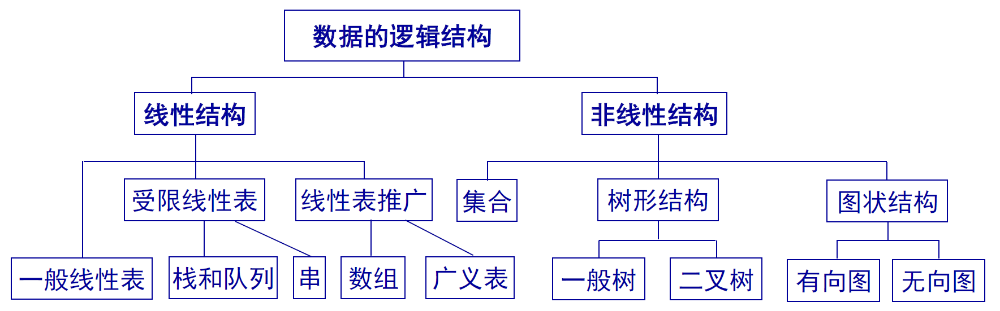
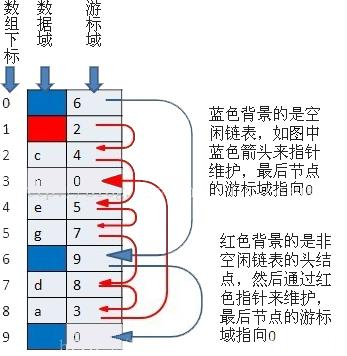
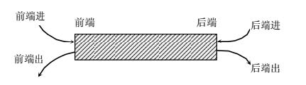

#! https://zhuanlan.zhihu.com/p/608729659

# 2023春 数据结构课堂记录

注: 纯粹是给自己看的, 顺手发到知乎上了. (讲的还行, 书我不喜欢, 停更)

## $\S$ 1. 绪论

什么是数据结构? 数据结构是一个介于数学, 计算机硬件和计算机软件之间的核心课程. 是软件相关里最基础的课程. ......

> 中国人午睡, 我以前困了就站着, 久而久之就不困了

多问为什么

<!-- 作业:期中:期末 = 5:1:4 -->

数据结构到底干什么?

**计算机处理问题**: 怎么进行处理? 处理问题的策略? (这叫 **算法**) 被处理的信息怎么表示? 问题的数学模型? (这叫 **数据结构**)  
Algorithms + Data Structures = Programs

程序设计问题有两类问题: 数值计算程序设计问题 / **非数值计算程序设计问题** (本门课需要解决的问题)

- **数值计算**: 结构静力分析计算; 天气预报
- **非数值计算**: 求 $n$ 个数字的最大值. 如何考虑完备性? 保证所有的用户输入都不会出现问题? 数字溢出了怎么办?

*线性表结构* / *树状结构* / *图结构*

数据结构描述现实世界实体的数学模型在计算机上的表现与操作. 考虑: 数据大小与相互关系; 如何在计算机中存储数据和其相互关系; 处理问题的时候需要对数据作什么运算; 所编写的程序的性能是否良好.

算法关心编程思想, 数据结构是思想的逻辑基础.

- **数据** 是能输入到计算机并被计算机处理的对象的总称.
- **数据元素** 是其中的一个个体, 是数据结构讨论的基本单位. 一个数据元素可以由若干个数据项组成, 数据项是数据不可分割的最小单位.
- **数据对象** 是性质相同的数据元素的集合, 是数据库的一个子集.
- **数据结构** 使之相互之间存在一定联系的数据元素的集合.  
关系可以是: 几个数字组成一个十进制数, 他们之间存在次序关系, 颠倒数据顺序数据就不相等了.  
数据元素之间的关系: (逻辑)结构. 通常有: 集合, 线性结构, 树形结构, 图状结构(网状结构).

数据结构的形式定义是一个二元组 $(D,S)$, 其中 $D$ 是数据元素的有限集, $S$ 是 $D$ 上关系的有限集.



关系的表示方法: **映像方法**, <a1,a2> 表示从a1到a2的关系. 可以有 **顺序表示** 和 **非顺序表示**, 顺序表示用元素的位置表示逻辑关系, 比如一维数组; 用指针的话就不需要顺序. 得到两种结构: 顺序存储结构和链式存储结构.

- **顺序结构**: 元素存放的地址是连续的或者差一个恒定常量, 这个恒定敞亮是一个隐含值, 所以存储结构只含有元素本身的信息.  
- **链式结构**: 地址是否连续没有要求, 于是需要用一个附加信息在某元素 $K_i$ 在一起, 表示 $K_{i+1}$ 的存储位置. 适合插入删除非常多的数据结构, 因为不需要更改其他元素的位置.

*很多高级语言都取消了指针的使用*.

算法的设计取决于逻辑结构, 实现依赖于存储结构. 例如: 十六位的整型, -32768~32767, 运算有: **+ - * / %**

**数据类型** 是一个值的集合和定义在该值集上的一组操作的总称.

**抽象数据类型(ADT)** 是指一个数字模型(数据结构)以及定义在该模型上的一组操作. 比如某种高级程序设计语言的整型, 尽管在不同处理器上实现的方法不同, 但是对于程序员来说是相同的. 它 **屏蔽了底层的差异**. *异构系统就在做抽象*
ADT的形式化定义是三元组: $ADT = (D,S,P)$, $D$ 是数据对象, $S$ 是 $D$ 上的关系集, $P$ 是对 $D$ 的基本操作集.  
抽象数据类型的定义取决于它的一组逻辑特性, 与其在计算机内的表示和实现无关, 就是把本质的特点抽象出来变成一个逻辑上的概念.  
**基本操作** 有参数, 初始条件, 操作结果. 赋值参数仅提供输入值, 引用参数以 & 打头, 除了可以提供输入值还可以返回操作结果.  
**初始条件** 描述了操作执行之前的数据结构等满足什么条件, 否则不执行  
**操作结果** 描述了做了什么事情

对数据结构非常宏观且直观的理解.

毕设/方案: 逻辑结构图, 是一个系统的架构. 包括很多东西. ...... 做工程之前也有给出一个算法整体的架构.
科学院处于研究和工程之间的阶段 (我觉得他说的就是软件所). 要把应用做到具体的型号工程里去. 很多大研究所参与国家重大工程. 需要对系统做出一些模型, 发挥很重要的作用.

**算法**: 是为了解决某类问题而求解步骤的一种描述, 是指令的有限序列, 其中每一条指令表示一个或多个操作.

算法具有五个 **特性**:
**有穷性** 一个算法必须总是在执行 **有穷步** 之后结束, 每一步都可在有穷时间内完成.
**确定性** 算法中每一条指令必须有确切的含义, 不存在 **二义性**. 在任何条件下, 只有唯一的一条执行路径; 对于相同的输入, 只能得到相同的输出.
**可行性** 一个算法是可行的, 即操作都可以通过已经实现的基本运算执行有限次来完成.
**有输入** 有零个或多个输入. 取自于某个特定的对象集合. 有的输入看起来没有, 但其实已经被嵌入算法.
**有输出** 有一个或多个输入. 这些输出是同输入有着某种特定关系的量.

**算法的表示**: 自然语言, 形式语言, 计算机程序设计语言.
程序不一定都是算法.

如何评判一个算法的好坏:

1. **正确性 (correctness)** 算法应该给出一个正确的结果. 尤其是: 对于精心选择的、典型、苛刻且带有刁难性的几组输入能够得出满足要求的结果.
2. **可读性 (readability)** 算法应该容易供人阅读和交流, 可读性好的算法有助于对算法的理解和修改. *代码规范* 希望从现在开始培养代码规范.
3. **健壮性 (robustness)** 算法应具有容错处理. 处理出错的方法不应该是中断程序的执行, 而是返回一个表示错误或错误性质的值.  
例子: 视察, 被线绊倒, 插头松动, 网络不通, 但没有给返回值, 找了半天才发现这是为什么.
4. **错误代码** 网络尤其常见.
5. **高效率 (High efficiency) 与低存储量 (Low memoryspace) 需求** 效率指的是算法执行的时间; 存储量需求指算法执行过程中所需要的最大存储空间.

算法执行时间需通过依据该算法编制的程序在计算机上运行所消耗的时间来度量:

- **事后统计法** 计算机内部进行执行时间和实际占用空间的统计. 缺点: 必须先运行依据算法编制的程序; 依赖软硬件环境, 容易掩盖算法本身的优劣
- **事前分析法** 求出该算法的一个时间界限函数 (复杂度分析)

程序运行所消耗的时间与很多东西有关: **依据算法选择何种策略** **问题的规模** 程序设计语言 编译出的机器代码的质量 机器执行指令的速度  
不妨认为只跟算法的策略和规模有关; 对于具体算法, 程序运行耗时只与规模有关: **算法的时间复杂度**

算法的时间度量 记作 $T(n)$, 与算法中基本操作重复执行的次数有关.

随着问题规模 $n$ 的增加, 算法执行时间的增长率和 $n$ 的某个函数的增长率相同, 那么我们说该算法的 (渐进) 时间量度 $T(n)=\mathop{}\!\mathrm{O}(f(n))$. 大O记号给出了函数 $f(n)$ 的一个上界.

例: $10n^2 + 4n + 2 = \mathop{}\!\mathrm{O}(n^2)$. $10n^2 +9 \neq \mathop{}\!\mathrm{O}(n^2)$. 后者可以反证法.

算法 = 控制结构 + 原操作 (固有数据类型的操作). 算法的执行时间与原操作执行次数之和成正比. 从算法中选取一种对于所研究的问题来说是基本操作的原操作, 以该基本操作在算法中重复执行的次数作为算法运行时间的衡量准则.

如何分析算法复杂度: 并列程序相加, 嵌套程序相乘.  
针对并列程序段, 有:
$$
T(n, m) = T_1 (n) + T_2 (m) = \mathop{}\!\mathrm{O}(\max(f(n), g(m)))
$$
针对嵌套程序段, 有:
$$
T(n, m) = T_1 (n) \times T_2 (m) = \mathop{}\!\mathrm{O}(f(n) \times g(m))
$$

例子:

``` C
for(i = 1; i <= n; ++i)
    for (j = 1; j <= n; ++j)
    {
        c[i][j] = 0;
        for(k = 1; k <= n; ++k)
            c[i][j] += a[i][k]*b[k][j];
    }
```

上面这是 $\mathop{}\!\mathrm{O}(n^3)$ 的算法.

``` C
for(i = 1; i <= n; ++i)
    for (j = 1; j <= n; ++j)
    {
        k = 1;
        while (k <= 5) k = 5 * k;
    }
```

上面这是 $\mathop{}\!\mathrm{O}(n^2\log_5 n)$ 的算法.

``` C
void func (int n)
{
    int i = 0; s = 0;
    while (s <= n)
    {
        i++;
        s = s + i;
    }
}
```

上面这是 $\mathop{}\!\mathrm{O}(n^{\frac{1}{2}})$ 的算法.

``` C
v
void BubbleSort (int a[], int n)
{
// 将 a 中整数序列重新排列成自小至大有序的整数序列
    for (i = n - 1, change = 1; i >= 1 && change; --i)
        for (j = 0, change = 0; j < i; ++j)
            if (a[j] > a[j + 1])
            {
                y = a[j];
                a[j] = a[j + 1];
                a[j + 1] = y;
                change = 1;
            }
}
```

上面这是最坏 $\mathop{}\!\mathrm{O}(n^2)$, 最好为 $0$ 的算法.

比较:
$$
c < \log_2 n < n < n\log_2 n < n^2 < n^3 < 2^n < 3^n < n! < n^n
$$

**空间复杂度(Space complexity)** 是指算法编写成程序后, 在计算机中运行时所需存储空间大小的度量. 记作 $S(n)=\mathop{}\!\mathrm{O}(g(n))$, 其中 $n$ 为问题的规模或大小.  
一般包括: 输入数据所占用的存储空间, 程序本身所占空间, 辅助变量所占空间.  
若所需额外空间相对于输入数据量来说是常数, 则称此算法为原地工作.  
若所需存储量依赖于特定的输入, 则通常按最坏情况考虑.

## $\S$ 2. 线性表

最简单的一类数据结构. 一个数据元素的有序 (是次序不是数值) 集.

包含线性表、栈、队列、串、广义表等.

线性结构的 **特点**:

1. 存在一个唯一的被称为 "第一个" 的数据元素
2. 存在一个唯一的被称为 "最后一个" 的数据元素
3. 除第一个元素外, 每个元素均有唯一一个直接前驱
4. 除最后一个元素外, 每个元素均有唯一一个直接后继

**线性表 (linear list)** 是具有相同特性的数据元素组成的有限序列, 且该序列中的所有结点具有相同的数据类型.  
若线性表中的结点是按值 (或按关键字) 由小到大或由大到小排列的, 称线排列为有序表.

**长度**是其中的数据元素个数. 首结点 尾结点 前驱 后继  
结点可以是**单值元素**; 也可以是**记录型元素**, 含有多个数据项, 每个项称为一个**域**, 每个元素有一个可以唯一标识每个结点的数据项组, 称为**关键字**.

很灵活, 可以插入删除.

**基本操作** (包含初始条件, 为了防止误操作, 写代码的时候一定要写上, 并且通过反馈表明操作是否失败):

- 结构初始化
- 结构的销毁(回收空间)
- 引用型操作(不改变数据表). 线性表判空 求线性表长度 求某个数据元素 定位数据元素 求前驱 求后继 遍历线性表
- 加工型操作(改变数据表结构). 将表置空 插入数据元素 删除数据元素 将元素赋值

全部都抽象成了这四类操作.

> 布置作业, 不反馈, 谁知道做没做  
> 领导布置任务, 结果谁都没干  
> 老师让写一个代码, 给了反馈说程序可以用了

例: 集合合并, 集合去重.

**线性表的顺序表示** 指的是用一组地址连续的存储单元依次存储线性表的数据元素

- 所有元素所占的存储空间是连续的
- 各数据元素在存储空间中按逻辑顺序依次存放

通常采用一维数组, 除了静态分配以外, 也可以动态分配内存.

``` C
#define LIST_INIT_SIZE 80 // 线性表初始大小
#define LISTINCREMENT 10  // 线性表增量大小
typedef struct {
ElemType elem; //线性表存储空间的基地址
int length;    // 线性表当前长度
int listsize;  //当前分配的存储容量
               // 以 sizeof ElemType 为单位
}
SqList; //顺序映象, 顺序表。
```

各种例子……

**线性表的链式存储** 是指用一组任意的 (连续的或不连续的) 存储单元存储线性表中的数据元素  
为了正确表示数据元素与其直接后续数据元素之间的逻辑关系, 在存储每个元素值的同时, 还必须存储指示其直接后继的地址 (或位置), 称为指针 (pointer) 或链 (link). 这两部分组成了链表中的结点.

—般情况下, 每个节点有一个或多个这样的指针域, 若一个节点中的某个指针域不需要指向任何节点, 则将它的位置为空(表示不指向任何节点), 用常量NULL表示;  
链表由多个节点组成, 这些节点的地址可以是连续的, 也可以是不连续的, 这意味着这些元素可以存储在任意未被占用的位置;  
链表中的第一个节点的存储位置成为头指针, 头指针为头节点的地址, 如果链表不带头节点, 头指针为开始节点的地址.

换句话说, 链表可以随便找地方存, 通过指针指向别的结点, 可以有好几个指针. 头结点 / 首元结点有所不同. (本人之前写的经常是没有头结点的链表)

**链表** 通过指针域将线性表的n个结点按其逻辑次序连接在一起.

- 线性链表 (单链表): 每一个结点只包含一个指向直接后继的指针域
- 双向链表: 每一个结点包含两个指针域, 其一指向直接后继, 另一指向直接前驱
- 循环链表: 整个链表的指针域连接成一个环
- 双向循环链表: 将头结点和尾结点连接起来的双向链表

头指针指向头结点或首元结点 (第一个结点)

结点的类型定义

``` C
typedef struct Lnode{
    ElemType data; /*数据域, 保存结点的值*/
    struct Lnode *next; /*指针域*/
}LNode, *LinkList; /*结点的类型*/
```

各种例子……

链表不是随机存取 (random access) 结构.

各种例子……PPT给了很多, 不少写法都和本人不一样 (TBO, 本人的写法未必是最快的)

改进链表? 链表plus. 表长需要存储, 表长也存储.

**静态链表**: 借用一维数组来描述线性链表, 数组中的一个分量表示一个节点, 同时使用游标 (指示器cur) 代替指针指示节点在数组中的相对位置, 数组中的第0个分量可以看成头节点, 其指针域指示静态链表的第一个节点
就是说, 开一块儿内存, 用另存的一个数字表明地址的偏移, 这样不需要指针就可以造链表.



```C
#define MAXSIZE 1000
typedef struct SLinked{
ElemType data;
int cur;
}
SLinkedList [MAXSIZE];
SLinkedList s;
```

双向链表, 循环链表, 都很简单. 双向链表要插两个指针

多项式: 用链表存储, 链表中存储几次项和这一项的系数是多少. 可以用链表完成操作.

## $\S$ 3. 栈和队列

**栈(Stack)**是限制在线性表的端进行插入和删除操作的线性表, 也称为后进先出 (LIF0, Last lnFirst Out) 或先进后出 (FILO, First ln Last Out) 线性表

- **栈顶(Top)** :  允许进行插入、删除操作的——端, 也称为表尾. 用栈顶指针来指示栈顶元素
- **栈底(Bottom/Base)** : 固定端, 也称为表头
- **空栈**: 当表中没有元素时称为空栈

n个元素顺序进栈，可能的出栈序列为Catalan数: $\frac{1}{n+1}\binom{2n}{n}$

顺序栈: 和顺序表很像, 用数组实现  
动态顺序栈表示数组大小可以改变 (再分配), 静态顺序栈表示不能改变

链式栈: 和链表很像

在栈中top和base分别指向栈顶和栈底, top == base 则栈空.

栈的存储方式几乎完全是线性表的特例, 无论是动态/静态的顺序栈, 还是链式栈, 几乎都是一样的方法.

一堆例子

表达式的三种方法: 前缀表示法, 中缀表示法, 后缀表示法

- 前缀表示法: OP S1 S2
- 中缀表示法: S1 OP S2
- 后缀表示法: S1 S2 OP

在定义一个过程或函数时出现调用本过程或函数自身，称之为递归，若直接调用自身，则称为 **直接递归**，若过程或函数 p 调用过程或函数 q ，而q 又调用 p ，则称之为 **间接递归**，递归算法指的是包含递归过程的算法。

如果一个递归过程或递归函数中递归调用语句是最后一条执行语句，则称这种递归调用为 **尾递归**。例如，以下算法是一个求

**线性递归**：也即是普通递归，单向递归，线性递归函数的最后一步操作不是递归操作，而是其他的操作。

递归程序是将复杂问题分解为一系列简单的问题，从要解的问题起，逐步分解，并将每步分解得到的问题放入“栈”中，这样栈顶是最后分解得到的最简单的问题，解决了这个问题后，次简单的问题可以得到答案，以此类推。分解问题是进栈（或者说压栈）的过程，解决问题是一个出栈的过程

例：求阶乘

```C
int Factorial (int n)
{
    if (n == 0)
        return 1;
    else
        return n * Factorial(n - 1);
}
```

递归工作栈：每一次递归调用时,责要太斛棰出闼霹的参数、局部变量等另外分配存储空间。每层递归调用需分配的空间形成递归工作记录,按后进先出的栈组织

递归与迭代...

队列 (Queue) 也是运算受限的线性表

- 只允许在表的一端进行插入，而在另一端进行删除
- 队头 (front) 允许进行删除的一端
- 队尾 (rear) 允许进行插入的一端
- 空队列 队列中没有元素

特性： 先进先出 (First In First Out FIFO) 先进入队列的成员总是先离开队列

所谓 **双端队列** 是指两端都可以进行进队和出队操作的队列，如图所示，将队列的两端分别称为前端和后端，两端都可以入队和出队。其元素的逻辑结构仍是线性结构。



## $\S$ 4. 串

**串** (即字符串，string) 是由零个或多个字符组成的有限序列

串是一类 **特殊的线性表**, 其逻辑结构和线性表极为相似，区别仅在于表中每个数据元素是一个字符. 组成串的字符少，字符数量可以很大，对串的操作种类多且复杂

串: $s = $ "$a_1a_2\,\dots\,a_n $"

串的名： $s$

串的值：双引号里的字符序列，但不包括双引号，双引号是 定界符 $a_i$ 可以是字母、数字和其他字符

串的长度：串中字符的数目 $n$

字符在串中的位置：字符在串中的位序

空串 (null string)：零个字符的串，长度为 $0$. $S=$“”

空格串 (blank string)：由空格组成的串 $S=$“ ”

子串, 主串, 前缀, 后缀, 串的相等

串的逻辑结构和线性表极为相似，区别仅仅在于串的数据对象约柬为字符集。然而，串的基本操作和线性表的基本操作有很大差别。

1. 在线性表的基本操作中，大多以 “单个元素” 作为操作对象，如:在线性表中查找某个元素、求取某个元素、在某个元素上插入一个元素和删除一个元素等
2. 在串的基本操作中，通常以 “串的整体” 作为操作对象。如在串中查找子串、插入子串、删除子串、替换子串等。

对于串的基本操作集可以有不同的定义方法，在使用高级语言中的串类型时，应以该语言的参考手册为准，在抽象数据类型定义的13种操作中: 串赋值StrAssign、串复制Strcopy、串比较StrCompare、求串长StrLength、串联接Concat以及求子串SubString等六种操作构成串类型的最小操作子集。

即: 这些操作不可能利用其他串操作来实现，反之，其他串操作（除串清除ClearString、串销毁DestroyString外）可在这个最小操作子集上实现。

串表示: 顺序表示, 堆, 链式表示

串定位/int Strlndex(SString s,SString t,int pos)

在主串s的第pos个字符之后寻找与t相等的子串，找到则返回第一个这样的子串在S中的位置，否则返回0

例如，s=“abcaabcaaabc”, t=“bca"

StrIndex(s,t,1)=2,Strlndex(s,t,3)=6, Strlndex(s,t,8)=0

Brute-force算法思想: 将主串s的第pos个字符和模式t的第1个字符比较. 若相等，继续逐个比较后续字符; 若不等，则从主串s的(pos+1)字符起，重新与t第1个字符比较。直到主串s的一个连续子串字符序列与模式t相等。返回值为s中与T匹配的子序列第一个字符的序号，即匹配成功，否则，匹配失败，返回值0。

树: 这本书上, 规定根节点是第一层